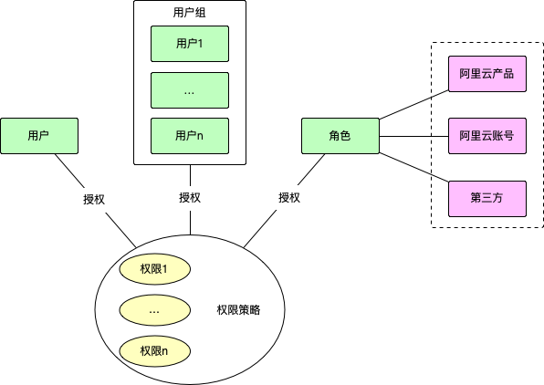

# 十分钟玩转阿里云访问控制

访问控制（Resource Access Management）是整个阿里云的基础，几乎所有的云产品都需要通过访问控制才能访问，权限类错误也是我们碰到的最高频的错误之一。
因此了解阿里云的访问控制对于阿里云的使用来说是非常关键的。

## 概述



访问控制简单理解就是，授权（或者禁止）给谁（授权主体）对什么资源做什么操作。

这里面授权主体又分为用户和角色。其中用户指的是同一个账号下不同的子账号，这个子账号可以对应一个具体的组织成员，并且允许通过控制台登录；
也可以仅提供 AccessKey 用于阿里云服务的调用，其本质就是一些权限的集合。

每个用户的权限都是独立的，可以单独配置，互不影响，但这样也会导致权限的管理比较繁琐，比如要个一个部门中的所有用户都新增某个云产品的权限，
需要每个用户都配置一遍。为了解决这个问题，引入了用户组的概念，用户组也是一个授权主体，可以给用户组授权，只需要将用户加入到用户组中，
用户组的权限会作用到每一个用户中。

阿里云的授权场景十分丰富，除了对当前账号的子账号授权，还可以对其他云账号、阿里云产品（阿里云产品可能也需要访问属于用户的资源，这时候也需要获得用户的授权）
以及其他第三方服务，比如钉钉等。

权限就是授权或禁止在资源上的操作（不包含授权主体），权限的集合叫做权限策略。

## 权限策略

访问控制里面最基本的概念就是权限，简单来说：

**权限** = **允许（禁止）** + **操作** + **资源**

这里面的操作，一般就是开放API的名称（也称 Action），而资源往往是API里面的一个参数，通常是可能是ID类。

以 ECS（云服务器） 为例，假如我们要停止一台服务器 `i-bp67acfmxazb4ph****`，就需要调用 [StopInstance](https://help.aliyun.com/zh/ecs/developer-reference/api-ecs-2014-05-26-stopinstance)
并用 `InstanceId` 来指定需要停止的服务器 `i-bp67acfmxazb4ph****`，这里面的**操作**就是 `StopInstance`，**资源**就是 `i-bp67acfmxazb4ph****`。

上面这些信息可以用 JSON 来描述为：

```json
{
  "Effect": "Allow",
  "Action": "StopInstance",
  "Resource": "i-bp67acfmxazb4ph****"
}
```

这就是最基本的权限模型，实际上，RAM 还支持条件生效，比如只能由某个 IP 发起调用，可以增加条件字段 Condition。

```json
{
  "Effect": "Allow",
  "Action": "StopInstance",
  "Resource": "i-bp67acfmxazb4ph****",
  "Condition": {
    "IpAddress": "203.0.113.2"
  }
}
```

在这个 JSON 的基础上作一些拓展和规范，我们就得到了[权限策略语言](https://help.aliyun.com/zh/ram/user-guide/policy-elements)

- 这里的 Action 可能会出现不同的云产品之间可能会相同，因此可以增加一些命名空间比如 `ecs:StopInstance`，表示是 ecs 产品的 StopInstance API
- 有时候我们可能需要批量授权，比如授权某一类操作给某一类资源，增加用 `*` 匹配的语法。

所以通常我们看到的权限策略可能是这样：

```json
{
    "Version": "1",
    "Statement": [
        {
            "Action": "ecs:Describe*",
            "Resource": "*",
            "Effect": "Allow"
        },
        {
            "Action": "ecs:List*",
            "Resource": "*",
            "Effect": "Allow"
        },
        {
            "Action": [
                "vpc:DescribeVpcs",
                "vpc:DescribeVSwitches"
            ],
            "Resource": "*",
            "Effect": "Allow"
        }
    ]
}
```

上面其实就是系统权限策略（即阿里云预定义的一些权限策略，一般比较粗糙） [AliyunECSReadOnlyAccess](https://ram.console.aliyun.com/policies/AliyunECSReadOnlyAccess/System/content)
的定义。除此之外，用户完全可以根据自己的需求定义更加精细的权限策略。

## 授权主体

光有权限策略，是不能控制访问的，因为权限策略里面缺乏了必要的主语，即控制谁，这就是授权主体。

最常见的授权主体就是当前账号的子账号，也就是用户，这种方式可以精确控制一个子用户的权限，包括控制台的使用，以及其 AccessKey 能够使用的云产品，
这种情况比较容易理解，就不再赘述。

除此之外，我们可能需要授权给另一个云账号（跨账号授权），比较直观的想法可能是直接授权给另一个账号的子账号，另一个账号的子用户直接使用他的 AccessKey 来访问。
但这里面有一个问题，AccessKey 和资源的拥有者，实际不是一个账号。RAM 并没有使用这样的模式，而是引入了一个新的概念——**角色**，

**角色**是一个虚拟的授权主体，其本身并不指带某一个具体的实体，但被授信的实体都可以扮演这个角色。这个概念可以非常形象地类比于演员和角色。
角色包含两个部分，权限策略和被授信的实体，其中权限策略就好比剧本，被授信的实体就是演员。

授权主体同样可以使用[权限策略语言](https://help.aliyun.com/zh/ram/user-guide/policy-elements)来描述：

```json
{
  "Principal": {
    "RAM": [
      "acs:ram::123456789012****:root",
      "acs:ram::987654321098****:root"
    ],
    "Service": "ecs.aliyuncs.com"
  }  
}
```

这里的 RAM 表示的就是授权给另一个阿里云账号，当然可以同时授权给多个账号，这里同时授权给了 `123456789012****` 和 `987654321098****` 两个账号。

Service 表示的是授权给阿里云产品（在 RAM 的授权体系中，其本质是一个特殊的阿里云账号，并且可以通过云产品的域名来表示），这里授权给了 ecs，
即 ecs 产品也有权限扮演这个角色，来获取这个角色所拥有的权限。

> 注意：一般的角色只会有一个授权主体，特别是通过阿里云控制台操作，这可能是为了简化角色的使用，但实际上，角色是可以授权给多个主体的，
> 这一点可以通过编辑权限策略的代码来实现。
> 此外，授权主体为阿里云产品其实是非常常见的，很多云产品都涉及到对用户资源的访问和操作，都会涉及到授权的问题。为了简化这些授权操作，
> 通常云产品会在控制台上引导用户自动创建一些必要的角色。

## 角色扮演

上面提到的跨账号授权场景，实际上只完成了授权部分，真正要实现跨账号的资源操作，还需要被授权的账号能够获取到访问凭证，这个过程就是角色扮演。
对应其实就是一个 STS 提供的一个 API [AssumeRole](https://help.aliyun.com/zh/ram/developer-reference/api-sts-2015-04-01-assumerole)。

这个 API 最重要的一个参数就是 RoleArn（样例：`acs:ram::123456789012****:role/adminrole`），也就是上面授权主体中角色的阿里云资源定位链接。

这个 API 会返回一个凭证 `Credentials`，主要是 `AccessKeyId/AccessKeySecret/SecurityToken` 三元组，这个三元组经常用于初始化阿里云的 client，
完成初始化的 client，就拥有了访问对应资源的权限。

```json
{
  "RequestId": "6894B13B-6D71-4EF5-88FA-F32781734A7F",
  "AssumedRoleUser": {
    "AssumedRoleId": "34458433936495****:alice",
    "Arn": "acs:ram::123456789012****:role/adminrole/alice"
  },
  "Credentials": {
    "SecurityToken": "********",
    "Expiration": "2015-04-09T11:52:19Z",
    "AccessKeySecret": "wyLTSmsyPGP1ohvvw8xYgB29dlGI8KMiH2pK****",
    "AccessKeyId": "STS.L4aBSCSJVMuKg5U1****"
  }
}
```

## 参考链接

- [阿里云访问控制官网文档](https://help.aliyun.com/zh/ram/)
- [阿里云访问控制产品](https://ram.console.aliyun.com/overview)
