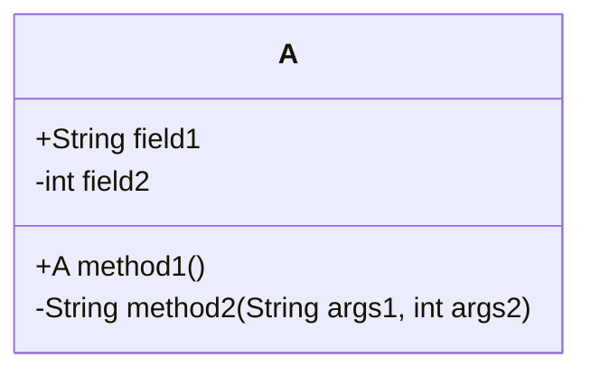
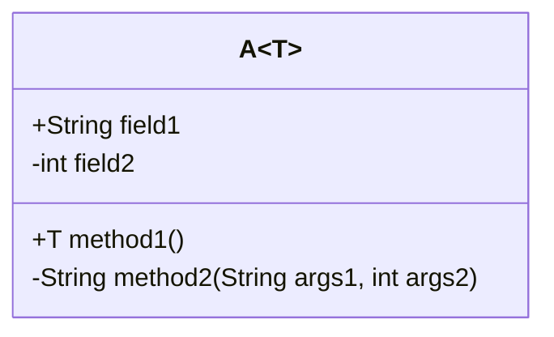
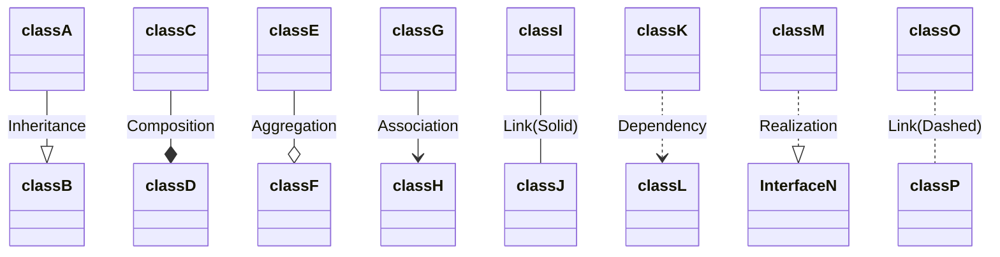
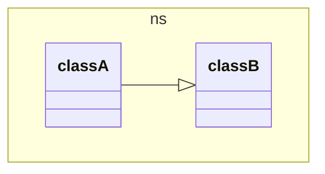
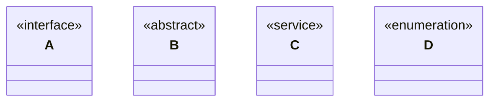
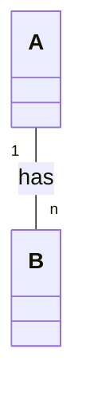

# markdown mermaid class 类图

## 定义类




## 泛型



## 关系



1. Inheritance: 继承，一个类继承另外一个类，或一个接口继承另一个接口
2. Composition: 组合，一个类包含另外一个类，也叫强聚合，强调整体与部分的关系，整体不存在了，部分也不存在了
3. Aggregation: 聚合，一个类包含另外一个类，整体和部分之间是可以分开的，整体不存在了，部分还是存在的
4. Association: 关联，一个类使用到了另外一个类
5. Link: 表示两个类之间有关系，但是关系不明确
6. Dependency: 依赖，一个类使用到了另外一个类，但是使用的是另外一个类的方法中的参数或者返回值
7. Realization: 实现，一个类实现了一个接口

## 命名空间



## 注解



## 基数



```mermaid
```

## 方向

```mermaid
classDiagram
  direction LR

  class A
  class B
```

## 参考链接

- [mermaid class diagrams](https://mermaid.js.org/syntax/classDiagram.html)
- [uml 中的六大关系](https://blog.csdn.net/cat_hate_fish/article/details/116332948)
