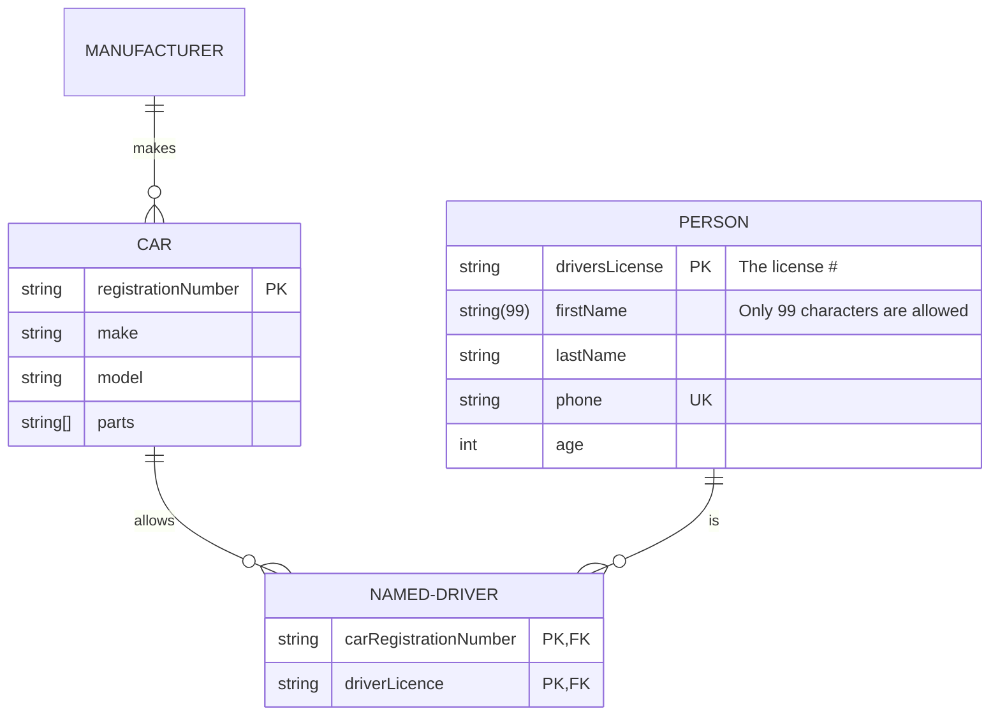

# markdown mermaid er 关系图

关系符号

- `||`：一个
- `|o`, `o|`：零或一个
- `}o`, `o{`: 零或多个
- `}|`, `|{`: 一个或多个

## 参考链接

- [mermaid Entity Relationship Diagrams](https://mermaid.js.org/syntax/entityRelationshipDiagram.html)
