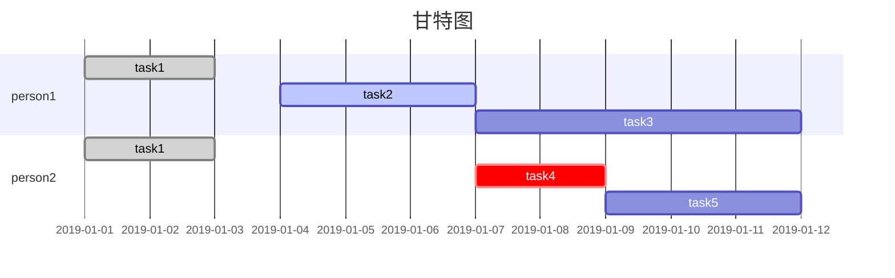

# markdown mermaid gantt 甘特图

- 任务后面描述：[status], [tag], [startDate], [duration|endDate]
- 任务状态：
    - done: 已完成（灰色）
    - active: 进行中（浅蓝）
    - crit: 风险（红色）
    - 无：未开始（紫）

## 参考链接

- [mermaid Gantt diagrams](https://mermaid.js.org/syntax/gantt.html)
