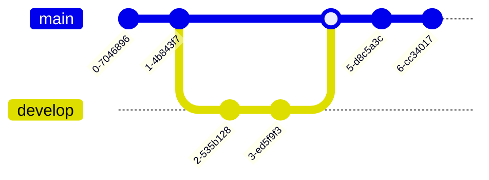
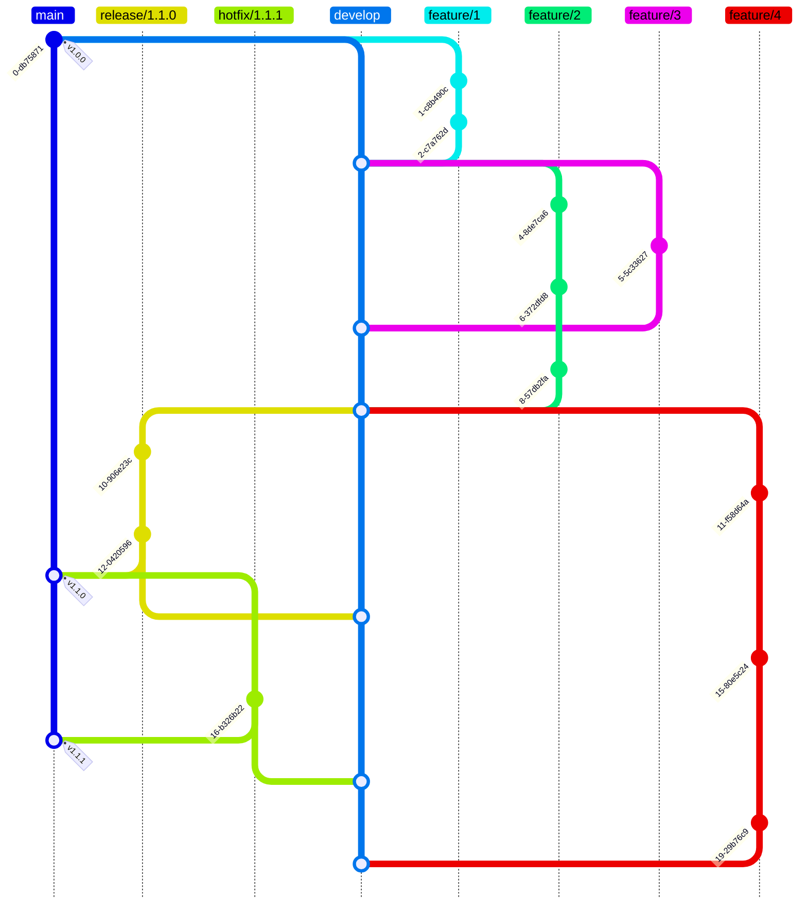

# markdown mermaid git graph

## 样例

## git flow 流程图

- 其行为和 git 命令一致，commit 提交代码，branch 创建分支，checkout 切换分支，merge 合并分支
- 改变方向：将 `gitGraph` 声明后面改为 `gitGraph TB` 即可
- 顺序：`order` 属性可以用来固定顺序，其值为权重，数字越大越靠后，比如 `order: 20` 会放到 `order: 12` 后面
- tag: `tag` 属性可以用来标注 tag，比如 `tag: "v1.0.0"` 会在 commit 上显示 `v1.0.0` 标签

## 参考链接

- [mermaid git graph](https://mermaid.js.org/syntax/gitgraph.html)
