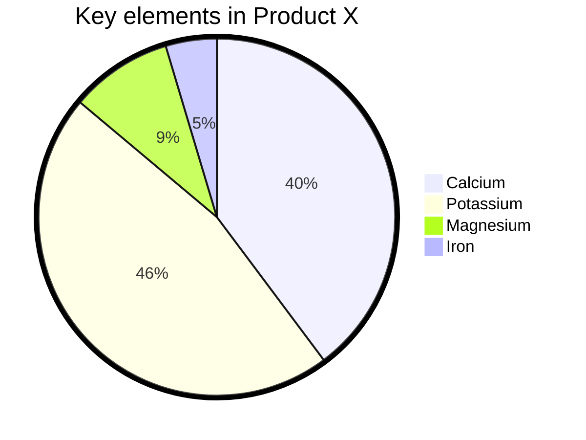

# markdown mermaid pie chart 饼图

```mermaid
%%{init: {"pie": {"textPosition": 0.5}, "themeVariables": {"pieOuterStrokeWidth": "5px"}} }%%
pie
  title Key elements in Product X
  "Calcium": 42.96
  "Potassium": 50.05
  "Magnesium": 10.01
  "Iron": 5
```

## 参考链接

- [mermaid pie chart 饼图](https://mermaid.js.org/syntax/pie.html)
