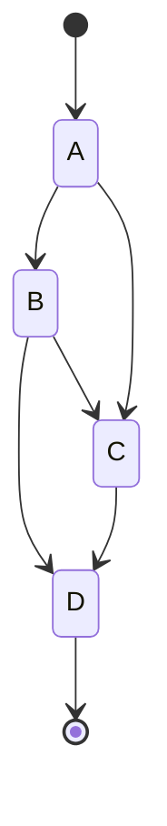
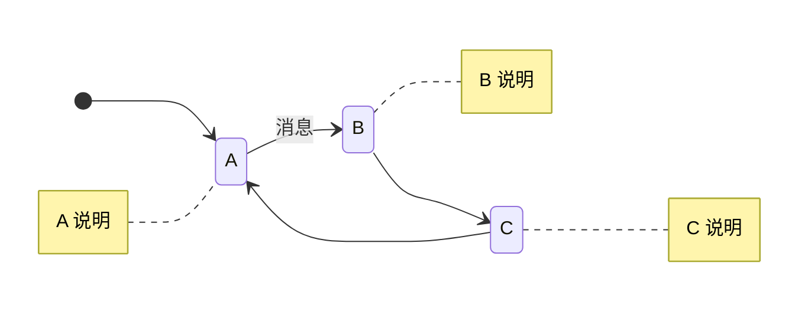
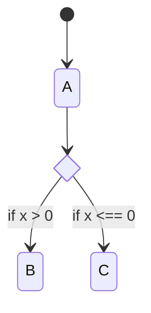
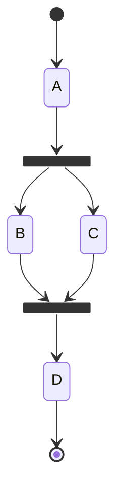
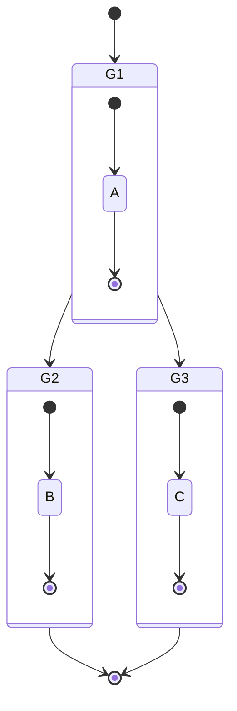
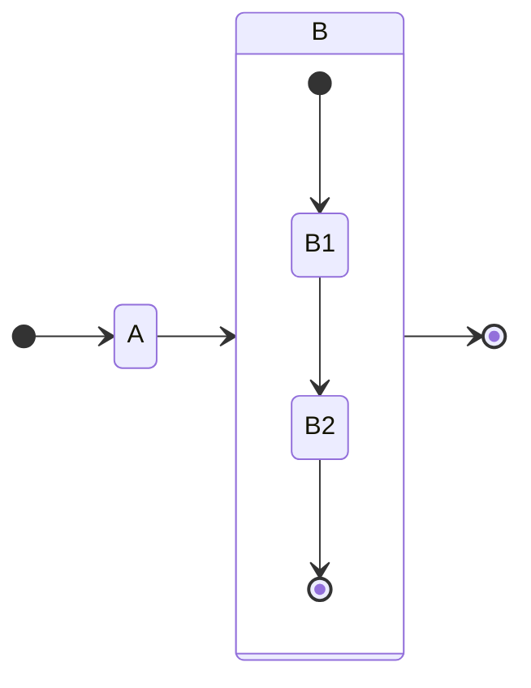
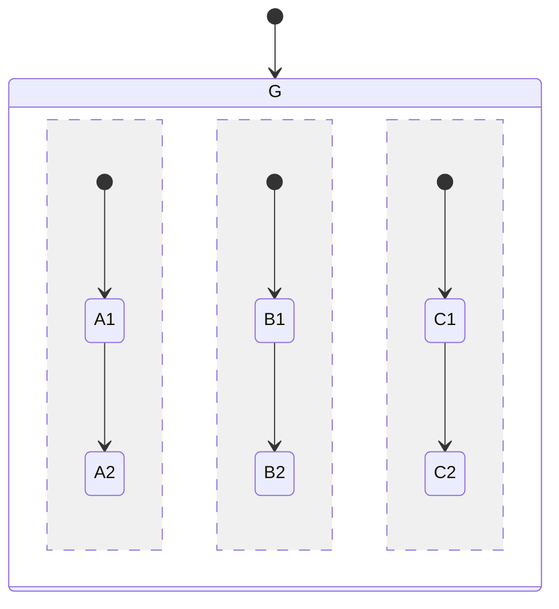

# markdown mermaid state 状态图

## 状态转换

```mermaid
stateDiagram-v2
  [*] --> A
  A --> B
  B --> C
  A --> C
  B --> D
  C --> D
  D --> [*]
```

## 消息和说明

```mermaid
stateDiagram-v2
  direction LR
  [*] --> A
  A --> B: 消息
  B --> C
  C --> A
  note left of A: A 说明
  note right of B: B 说明
  note right of C: C 说明 
```

## 条件

```mermaid
stateDiagram-v2
  state cond <<choice>>
  [*] --> A
  A --> cond
  cond --> B: if x > 0
  cond --> C: if x <== 0
```

## 分叉和合并

```mermaid
stateDiagram-v2
  state fork <<fork>>
  state join <<join>>
  [*] --> A
  A --> fork
  fork --> B
  fork --> C
  B --> join
  C --> join
  join --> D
  D --> [*]
```

## 复合状态

```mermaid
stateDiagram-v2
  [*] --> G1
  G1 --> G2
  G1 --> G3
  G2 --> [*]
  G3 --> [*]

  state G1 {
    [*] --> A
    A --> [*]
  }

  state G2 {
    [*] --> B
    B --> [*]
  }

  state G3 {
    [*] --> C
    C --> [*]
  }
```

## 方向

```mermaid
stateDiagram-v2
  direction LR
  [*] --> A
  A --> B
  B --> [*]

  state B {
    direction TB
    [*] --> B1
    B1 --> B2
    B2 --> [*]
  }
```

## 并行

```mermaid
stateDiagram-v2
  [*] --> G

  state G {
    [*] --> A1
    A1 --> A2
    --
    [*] --> B1
    B1 --> B2
    --
    [*] --> C1
    C1 --> C2
  }
```

## 参考链接

- [mermaid state diagrams](https://mermaid.js.org/syntax/stateDiagram.html)
