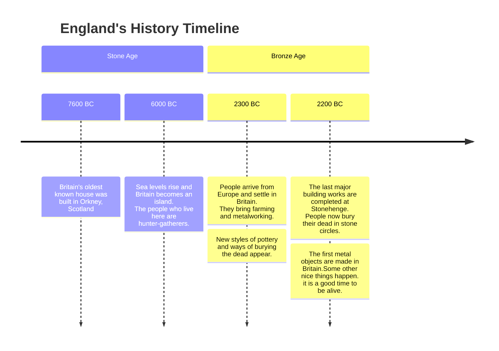

# markdown mermaid timeline 时间轴

```mermaid
timeline
  title England's History Timeline
  section Stone Age
    7600 BC: Britain's oldest known house was built in Orkney, Scotland
    6000 BC: Sea levels rise and Britain becomes an island.<br> The people who live here are hunter-gatherers.
  section Bronze Age
    2300 BC: People arrive from Europe and settle in Britain. <br>They bring farming and metalworking.
        : New styles of pottery and ways of burying the dead appear.
    2200 BC: The last major building works are completed at Stonehenge.<br> People now bury their dead in stone circles.
        : The first metal objects are made in Britain.Some other nice things happen. it is a good time to be alive.
```

## 参考链接

- [mermaid Timeline Diagram](https://mermaid.js.org/syntax/timeline.html)
