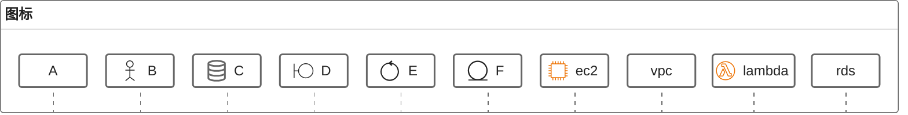
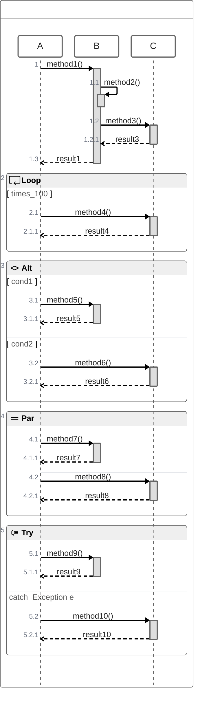

# markdown mermaid zenuml 时序图

相比于 sequence 时序图，zenuml 时序图更加简洁，使用更加贴近过程式编程的语法，使用起来更加自然，更具逻辑性，并添加了一些云服务的图标。

## 图标

添加了很多云服务的图标，可以用来画云服务的架构图。

## 代码

## 参考链接

- [mermaid zenuml](https://mermaid.js.org/syntax/zenuml.html)
