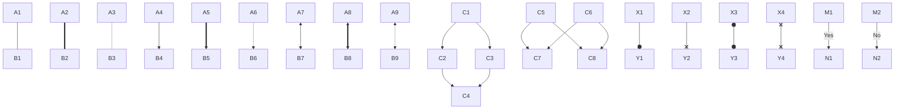
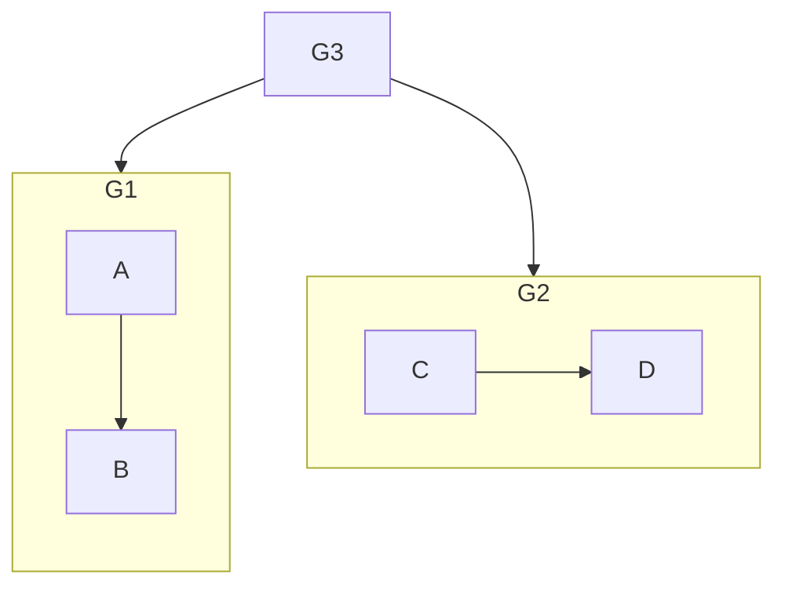

# markdown mermaid flowchart 流程图

## 图形

```mermaid
flowchart
  A(矩形)
  B([半圆矩形])
  C[[双线矩形]]
  D[(圆柱体)]
  E((圆形))
  F>左尖又方]
  G{菱形}
  H{{六边形}}
  I[/平行四边形/]
  J[\平行四边形\]
  K[/梯形\]
  L[\梯形/]
  M(((双圆形)))
```

## 线

```mermaid
flowchart
  A1 --- B1
  A2 === B2
  A3 -.- B3
  A4 --> B4
  A5 ==> B5
  A6 -.-> B6
  A7 <--> B7
  A8 <==> B8
  A9 <-.-> B9
  C1 --> C2 & C3 --> C4
  C5 & C6 --> C7 & C8
  X1 --o Y1
  X2 --x Y2
  X3 o--o Y3
  X4 x--x Y4
  M1 -->|Yes| N1
  M2 -->|No| N2
```

## 子图形

```mermaid
flowchart
  subgraph G1
    direction TB
    A --> B
  end

  subgraph G2
    direction LR
    C --> D
  end

  G3 --> G1
  G3 --> G2
```

## 参考链接

- [flowchart](https://mermaid.js.org/syntax/flowchart.html)
