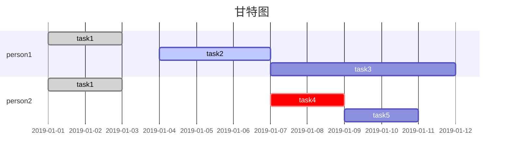

# markdown mermaid gantt 甘特图

- 任务后面描述：`[status], [tag], [startDate], [duration|endDate]`
    - status: 任务状态，可选值为 `done`, `active`, `crit`
    - tag: 任务标识，用于关联任务
    - startDate: 任务开始日期，可以是日期格式，也可以用 `after [tag]` 表示在某个任务之后
    - duration: 任务持续时间，可以是数字加单位，也可以是日期格式
- 任务状态：
    - `done`: 已完成（灰色）
    - `active`: 进行中（浅蓝）
    - `crit`: 风险（红色）
    - 无：未开始（紫）

## 参考链接

- [mermaid Gantt diagrams](https://mermaid.js.org/syntax/gantt.html)
