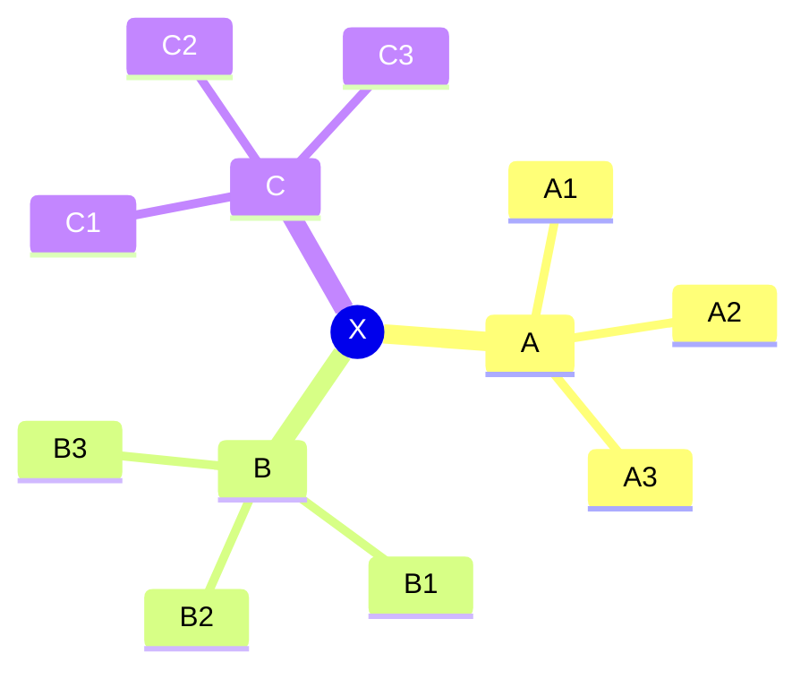
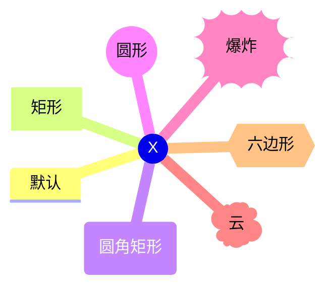

# markdown mermaid midmaps 脑图

```mermaid
mindmap
  root((X))
    A
      A1
      A2
      A3
    B
      B1
      B2
      B3
    C
      C1
      C2
      C3
```

## 形状

```mermaid
mindmap
  root((X))
    默认
    A[矩形]
    B(圆角矩形)
    C((圆形))
    D))爆炸((
    E)云(
    F{{六边形}}
```

## 参考链接

- [mermaid Mindmap](https://mermaid.js.org/syntax/mindmap.html)
