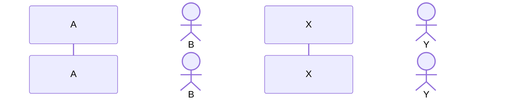
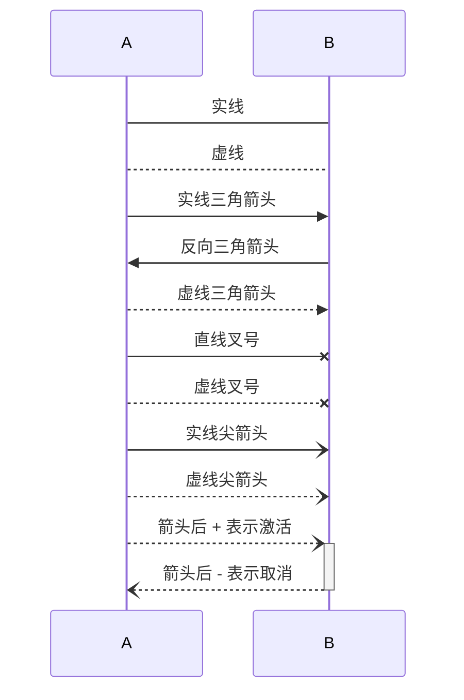
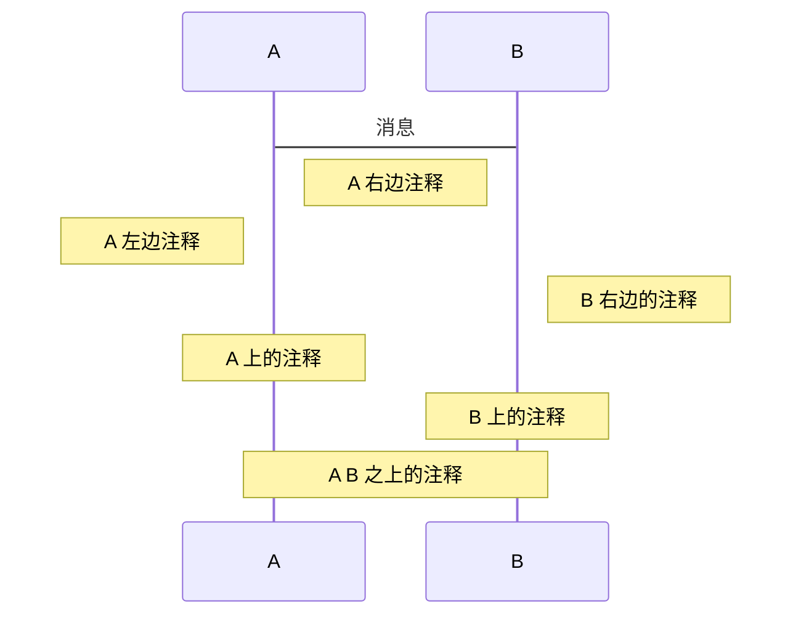
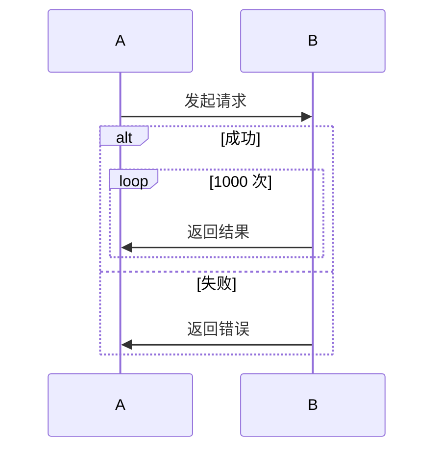
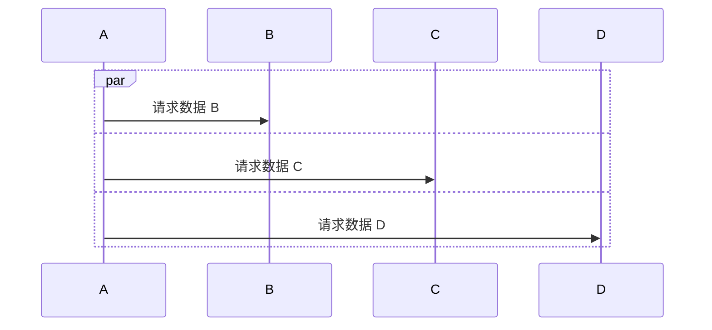
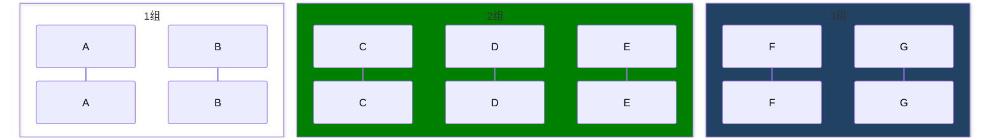
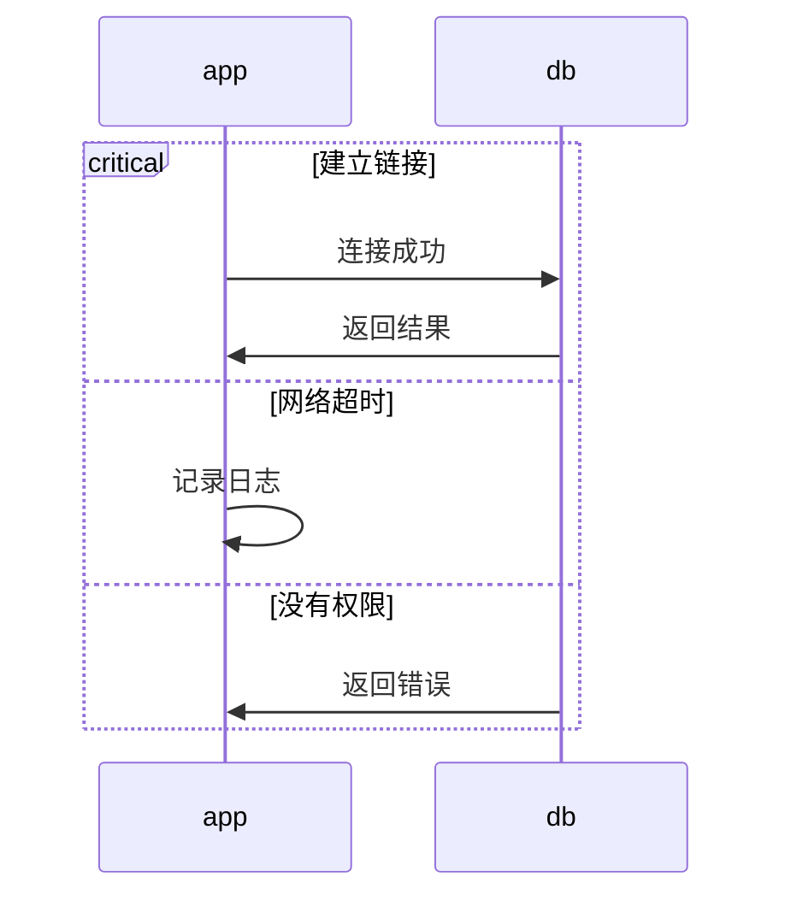
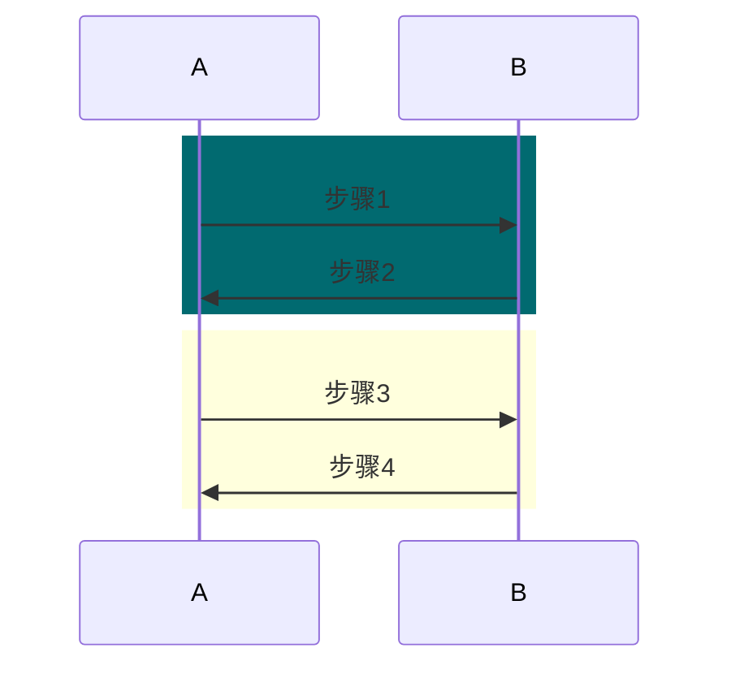

# markdown mermaid sequence 时序图

## 图标

```mermaid
sequenceDiagram
  participant A
  actor B
  participant C as X
  actor D as Y
```

## 箭头

```mermaid
sequenceDiagram
  A -> B: 实线
  A --> B: 虚线
  A ->> B: 实线三角箭头
  B ->> A: 反向三角箭头
  A -->> B: 虚线三角箭头
  A -x B: 直线叉号
  A --x B: 虚线叉号
  A -) B: 实线尖箭头
  A --) B: 虚线尖箭头
  A --)+ B: 箭头后 + 表示激活
  B --)- A: 箭头后 - 表示取消
```

## 消息和注释

```mermaid
sequenceDiagram
  A -> B: 消息
  Note right of A: A 右边注释
  Note left of A: A 左边注释
  Note right of B: B 右边的注释
  Note over A: A 上的注释
  Note over B: B 上的注释
  Note over A, B: A B 之上的注释
```

## 循环和条件

```mermaid
sequenceDiagram
  A ->> B: 发起请求
  alt 成功
    loop 1000 次
      B ->> A: 返回结果
    end
  else 失败
    B ->> A: 返回错误
  end
```

## 并发

```mermaid
sequenceDiagram
  par
    A ->> B: 请求数据 B
  and
    A ->> C: 请求数据 C
  and
    A ->> D: 请求数据 D
  end
```

## 分组

```mermaid
sequenceDiagram
  box 1组
    participant A
    participant B
  end
  box Green 2组
    participant C
    participant D
    participant E
  end
  box rgb(33,66,99) 3组
    participant F
    participant G
  end
```

## 关键区域

```mermaid
sequenceDiagram
  critical 建立链接
    app ->> db: 连接成功
    db ->> app: 返回结果
  option 网络超时
    app ->> app: 记录日志
  option 没有权限
    db ->> app: 返回错误
  end
```

## 矩形区域

```mermaid
sequenceDiagram
  rect rgb(1, 106, 112)
    A ->> B: 步骤1
    B ->> A: 步骤2
  end
  rect rgb(255, 255, 221)
    A ->> B: 步骤3
    B ->> A: 步骤4
  end
```

## 参考链接

- [mermaid sequence diagram](https://mermaid.js.org/syntax/sequenceDiagram.html)
