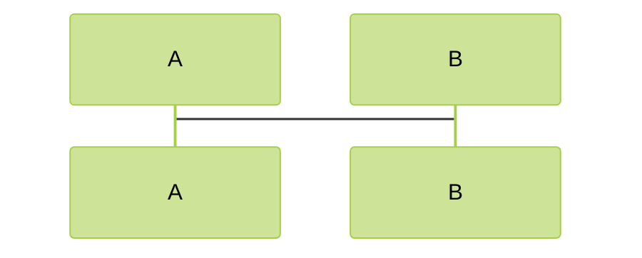

# markdown mermaid 绘图

mermaid 是一个用代码绘制流程图、状态图、时序图、甘特图的工具。可以集成在 markdown 中使用。
github 和 gitlab 都支持 mermaid 语法，jetbrains 安装 mermaid 插件也可以支持。

## jetbrains 插件安装

jetbrains 需要安装插件 mermaid。安装步骤如下：

1. 打开设置 **Setting** -> **Plugins** -> **Marketplace**
2. 搜索 **mermaid**，安装 **Mermaid**

## vscode 配置

1. 安装插件 **Markdown Preview Mermaid Support** 即可

## 主题配置

通过注释的方式可以配置主题，`%%{init: {'theme':'forest'}}%%`。可选的主题值包括：

- default: 默认
- neutral: 中性
- dark: 暗色
- forest: 森林
- base: 基础

## 参考链接

- [mermaid 官网](https://mermaid.js.org/intro/)
- [Draw Diagrams With Markdown](https://support.typora.io/Draw-Diagrams-With-Markdown/)
- [取色网站](https://colorhunt.co/)
