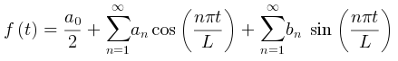

# markdown plantuml math 数学公式

vscode 和 jetbrains 目前都不支持。

## 参考链接

- [plantuml math](https://plantuml.com/zh/ascii-math)
- [asciiMath 语法](http://asciimath.org/)
- [latex math 语法](https://github.com/opencollab/jlatexmath)
