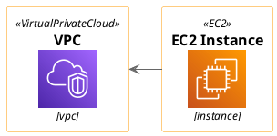
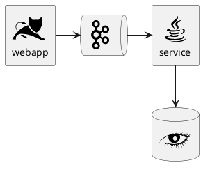
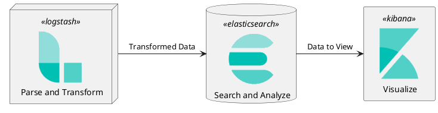
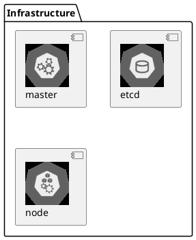
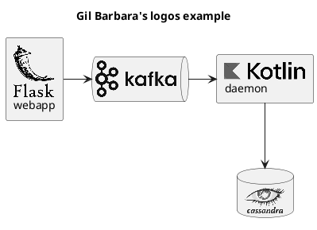

# markdown plantuml stdlib 标准库

## aws

```plantuml
@startuml
!include <awslib/AWSCommon>
!include <awslib/InternetOfThings/IoTRule>
!include <awslib/Analytics/KinesisDataStreams>
!include <awslib/ApplicationIntegration/SimpleQueueService>
!include <awslib/Compute/EC2>
!include <awslib/NetworkingContentDelivery/VirtualPrivateCloud>


VirtualPrivateCloud(vpc, "VPC", "vpc")
EC2(instance, "EC2 Instance", "instance")

instance -left-> vpc

@enduml
```

## cloud insight

```plantuml
@startuml

!include <cloudinsight/tomcat>
!include <cloudinsight/kafka>
!include <cloudinsight/java>
!include <cloudinsight/cassandra>

rectangle "<$tomcat>\nwebapp" as webapp
queue "<$kafka>" as kafka
rectangle "<$java>\nservice" as service
database "<$cassandra>" as cassandra

webapp -> kafka
kafka -> service
service --> cassandra

@enduml
```

## elasticsearch

```plantuml
@startuml
!include <elastic/common>
!include <elastic/elasticsearch/elasticsearch>
!include <elastic/logstash/logstash>
!include <elastic/kibana/kibana>

ELASTICSEARCH(ElasticSearch, "Search and Analyze",database)
LOGSTASH(Logstash, "Parse and Transform",node)
KIBANA(Kibana, "Visualize",agent) 

Logstash -right-> ElasticSearch: Transformed Data
ElasticSearch -right-> Kibana: Data to View
@enduml
```

## kubernetes

```plantuml
@startuml
!include <kubernetes/k8s-sprites-unlabeled-25pct>
package "Infrastructure" {
  component "<$master>\nmaster" as master
  component "<$etcd>\netcd" as etcd
  component "<$node>\nnode" as node
}
@enduml
```

## logos

```plantuml
@startuml
!include <logos/flask>
!include <logos/kafka>
!include <logos/kotlin>
!include <logos/cassandra>

title Gil Barbara's logos example

skinparam monochrome true

rectangle "<$flask>\nwebapp" as webapp
queue "<$kafka>" as kafka
rectangle "<$kotlin>\ndaemon" as daemon
database "<$cassandra>" as cassandra

webapp -> kafka
kafka -> daemon
daemon --> cassandra
@enduml
```

## 参考链接

- [plantuml stdlib](https://plantuml.com/zh/stdlib)
