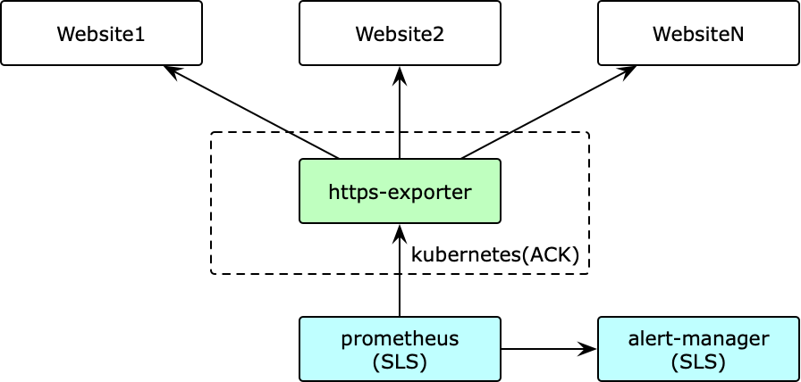
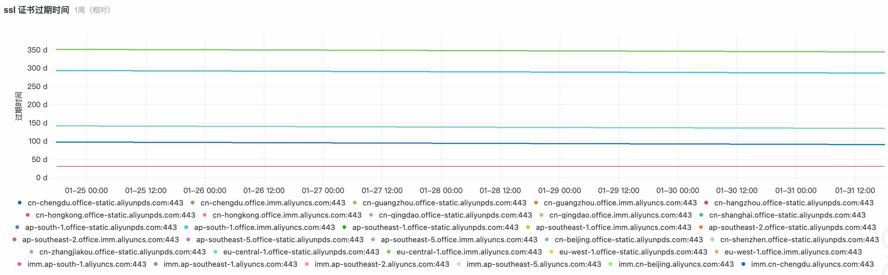
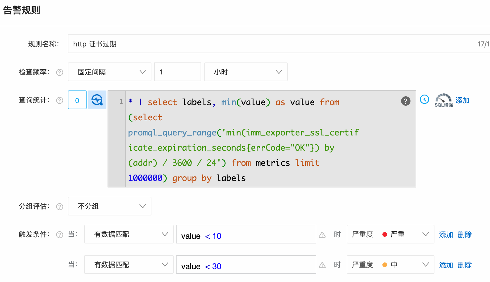

# exporter 实践之 https 证书过期实践

## 概述

https 证书有过期时间，证书过期还未更换会导致网站无法访问（浏览器默认会拒绝过期的证书），网站的用户能直接感受到服务故障，影响很大。
因此证书过期实践的探测和预警非常重要。一般证书颁发机构可以提供一个证书过期的告警机制，但是这种机制只能提示证书本身即将过期，
而无法具体到网站，因此网站证书更新可能存在遗漏更新，以及未确认证书更新的问题。

为了做到网站级别的证书更新探测和预警。我们使用 prometheus 方案去探测网站证书的过期时间，实现 exporter，
并将数据写入到阿里云的 sls，再从 sls 中触发告警。

## 总体架构



实现 https-exporter 定期从获取网站证书过期实践，部署在阿里云 ACK 集群中。
使用阿里云 SLS 拉取 exporter 中的数据持久化，基于 SLS 绘制图表和告警。

## 数据获取

使用 golang 实现 exporter 服务，对外提供 metrics 接口，返回指标信息

### 指标设计

指标通过定期获取证书，计算过期时间来获得，因此需要可以直接设置，使用 `Gauge` 可以满足需求

```golang
promauto.NewGaugeVec(prometheus.GaugeOpts{
    Namespace:   options.Namespace,
    Subsystem:   options.Subsystem,
    Name:        "ssl_certificate_expiration_seconds",
    ConstLabels: nil,
}, []string{"addr", "errCode"})
```

- 指标名: `ssl_certificate_expiration_seconds`
- 维度:
    - `addr`: 监控的网站
    - `errCode`: 监控状态，异常情况下可能由于网络问题无法访问地址，通过该状态码来标识，`OK` 表示监控状态正常

参考样例

```prometheus
ssl_certificate_expiration_seconds{addr="domain1.com:443",errCode="OK"} 1.159258201135622e+07
ssl_certificate_expiration_seconds{addr="domain2.com:443",errCode="OK"} 1.159258201135622e+07
ssl_certificate_expiration_seconds{addr="domain3.com:443",errCode="Timeout"} 1.159258201135622e+07
```

### 获取过期时间

golang 的 `tls.DialWithDialer` 方法可以和网站建立链接，并获取证书，从证书中可以计算出过期时间

```golang
conn, err := tls.DialWithDialer(&net.Dialer{Timeout: timeout}, "tcp", addr, &tls.Config{
    InsecureSkipVerify: true,
})
if err != nil {
    return 0, err
}
defer conn.Close()

certs := conn.ConnectionState().PeerCertificates
for _, cert := range certs {
    return cert.NotAfter.Sub(time.Now()), nil
}
```

### 定期获取

每隔固定时间建立一次链接，获取过期时间，并设置 `Gauge` 的值为新的过期时间

```golang
func (e *SSLCertificateCollector) Collect() {
	e.wg.Add(1)
	go func() {
		ticker := time.NewTicker(e.options.Interval)
		defer ticker.Stop()
	out:
		for {
			for _, addr := range e.options.Hosts {
				d, err := FetchOneSSLCertificate(addr, e.options.DialTimeout)
				e.gauge.WithLabelValues(addr, ErrCode(err)).Set(d.Seconds())
				if err != nil {
					e.logger.Warnf("", log.String("Addr", addr), log.String("ErrType", ErrType(err)), log.Error(err))
				}
			}

			select {
			case <-e.ctx.Done():
				break out
			case <-ticker.C:
				continue
			}
		}
		e.wg.Done()
	}()
}
```

### 开启 exporter 服务

在 9100 端口开启 exporter 服务

```golang
sslCertificateCollector := sslcertificate.NewSSLCertificateExporterWithOptions(&options.SSLCertificate)
sslCertificateCollector.Collect()
defer sslCertificateCollector.Stop()

http.Handle("/metrics", promhttp.Handler())
if err := http.ListenAndServe(":9100", nil); err != nil {
    panic(err)
}
```

### 部署到 K8S 中

声明这三个 annotations，可以让 prometheus 自动发现该 exporter，并收集数据到 prometheus server 中

- `prometheus.io/scrape: "true"`: 开启抓取监控数据
- `prometheus.io/port: "9100"`: metrics 端口 9100
- `prometheus.io/path: /metrics`: metrics 路径 `/metrics`

```text
apiVersion: apps/v1
kind: Deployment
metadata:
  namespace: {{ .Release.Namespace }}
  name: {{ .Values.name }}
  labels:
    app: {{ .Values.name }}
spec:
  replicas: 1
  selector:
    matchLabels:
      app: {{.Values.name}}
  template:
    metadata:
      labels:
        app: {{.Values.name}}
      annotations:
        prometheus.io/scrape: "true"
        prometheus.io/port: "9100"
        prometheus.io/path: /metrics
    spec:
      {{- if .Values.image.pullSecret }}
      imagePullSecrets:
        - name: {{ .Values.image.pullSecret }}
      {{- end }}
      containers:
        - name: {{.Values.name}}
          image: {{ .Values.image.repository }}:{{ .Values.image.tag }}
          ports:
            - containerPort: 9100
```

有些域名设置了自动 dns，在 vpc 内部解析到一个内网地址，而对应的服务却在其他地区，可以在 deployments 中指定公网 dns 服务器来解决

```yaml
# spec.template.spec 下新增
dnsPolicy: "None"
dnsConfig:
  nameservers:
    - 223.5.5.5
```

- 国内 dns 服务器地址参考: <https://dnsdaquan.com/>
- kubernetes dns 设置: <https://kubernetes.io/docs/concepts/services-networking/dns-pod-service/>

## 数据存储

prometheus 自带后端，但其可视化以及告警服务都需要额外部署和运维，直接使用 SLS 可以避免这部分工作。

在 ACK 中安装 arms-prometheus，修改 prometheus 配置文件，通过 Remote Write 协议将数据写入到 SLS。

```yaml
global:
  scrape_interval: 15s
  evaluation_interval: 15s
remote_write:
  - url: "https://${SLS_PROJECT}.${REGION_ID}-intranet.log.aliyuncs.com/prometheus/${SLS_PROJECT}/${SLS_LOGSTORE}/api/v1/write"
    basic_auth:
      username: ${OPS_AK}
      password: ${OPS_SK}
```

## 告警触发

### 监控图表

```shell
* | select promql_query_range('min(imm_exporter_ssl_certificate_expiration_seconds{errCode="OK"}) by (addr) / 3600 / 24') from metrics limit 1000000
```



### 告警触发

- 过期前 30 天触发告警
- 过期前 10 天触发电话告警

```shell
* | select labels, min(value) as value from (select promql_query_range('min(imm_exporter_ssl_certificate_expiration_seconds{errCode="OK"}) by (addr) / 3600 / 24') from metrics limit 1000000) group by labels
```



## 参考链接

- [SLS 通过Remote Write协议接入Prometheus监控数据](https://help.aliyun.com/document_detail/171781.html)
