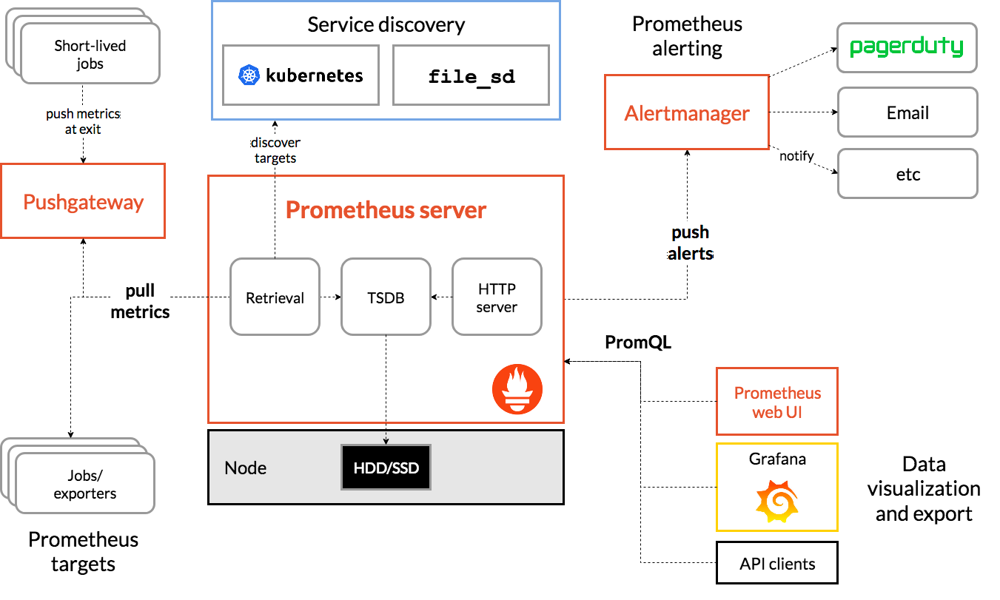

# prometheus 简介

prometheus 是一个开源的监控和告警工具集合

## 特性

- 多维的时间序列数据，由指标名和键值对标识
- PromQL，灵活的数据查询语言
- 不依赖分布式存储，支持单节点部署
- 支持通过 http 拉取来收集数据
- 支持通过 Pushgateway 推送数据
- 支持多种模式的图表和大盘

## 架构

- Prometheus server: 抓取和保存时序数据
- Pushgateway: 推送数据网关，任务无法暴露 http 服务，可以主动推送数据到 Pushgateway，再由 Prometheus server 收集数据
- exporters: 暴露 http 服务，prometheus server 通过 http 端口收集时序数据
- Alertmanager: Prometheus server 将告警推送至告警系统，由告警系统发出告警
- Prometheus web UI: prometheus 提供的 web 界面，可通过 PromQL 查询数据
- Grafana: 可视化时序数据

## 参考链接

- prometheus 官网: <https://prometheus.io/>
