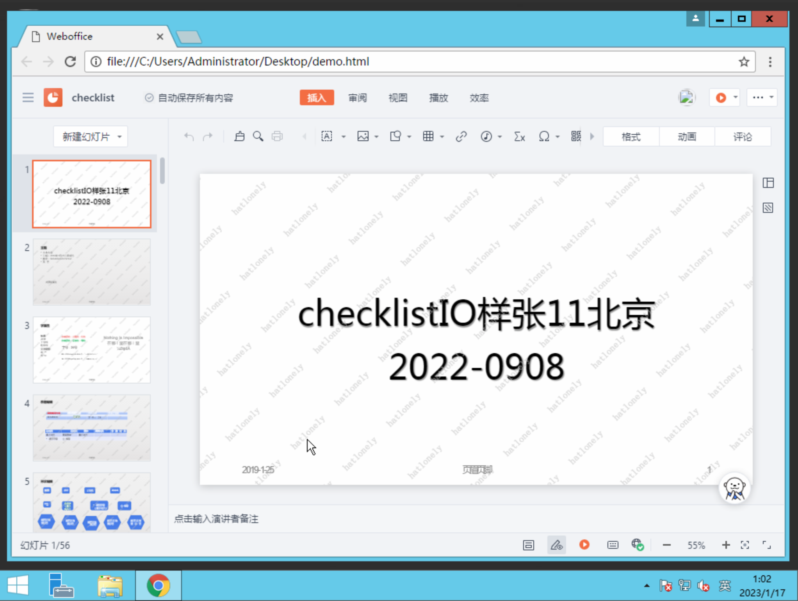

# vpc 文档预览

## 测试环境准备

1. 在 VPC 内创建一台 4C8G 的 windows 机器

```tf
provider "alicloud" {}

resource "alicloud_vpc" "vpc" {
  vpc_name   = "tf-imm-document-preview-test-vpc"
  cidr_block = "172.16.0.0/12"
}

resource "alicloud_vswitch" "vsw" {
  vpc_id     = alicloud_vpc.vpc.id
  cidr_block = "172.16.0.0/21"
  zone_id    = "cn-beijing-b"
}

resource "alicloud_security_group" "default" {
  name   = "default"
  vpc_id = alicloud_vpc.vpc.id
}

resource "alicloud_security_group_rule" "allow_all_tcp" {
  type              = "ingress"
  ip_protocol       = "tcp"
  nic_type          = "intranet"
  policy            = "accept"
  port_range        = "1/65535"
  priority          = 1
  security_group_id = alicloud_security_group.default.id
  cidr_ip           = "0.0.0.0/0"
}

data "alicloud_instance_types" "ecs_4c8g" {
  cpu_core_count = 4
  memory_size    = 8
}

resource "random_password" "password" {
  length           = 20
  special          = true
  override_special = "!#$%^&*()-_=+[]{}<>:?"
}

resource "alicloud_instance" "instance" {
  availability_zone = "cn-beijing-b"
  security_groups   = alicloud_security_group.default.*.id

  instance_type              = data.alicloud_instance_types.ecs_4c8g.instance_types[0].id
  instance_charge_type       = "PostPaid"
  system_disk_category       = "cloud_efficiency"
  image_id                   = "win2012r2_9600_x64_dtc_zh-cn_40G_alibase_20221219.vhd"
  instance_name              = "tf-imm-document-preview-test"
  vswitch_id                 = alicloud_vswitch.vsw.id
  internet_max_bandwidth_out = 0
  password                   = random_password.password.result
}
```

2. 获取 chrome，上传至同 region 的 oss bucket

```shell
wget https://www.slimjetbrowser.com/chrome/win/chrome64_55.0.2883.75.exe
ossutil -i "${ALICLOUD_ACCESS_KEY}" -k "${ALICLOUD_SECRET_KEY}" -e oss-${ALICLOUD_REGION}.aliyuncs.com cp chrome64_55.0.2883.75.exe oss://imm-test-hl-cn-beijing/chrome64_55.0.2883.75.exe
ossutil -i "${ALICLOUD_ACCESS_KEY}" -k "${ALICLOUD_SECRET_KEY}" -e oss-${ALICLOUD_REGION}.aliyuncs.com sign oss://imm-test-hl-cn-beijing/chrome64_55.0.2883.75.exe | sed 's/.aliyuncs.com/-internal.aliyuncs.com/'
```

3. 由于在 vpc 内没有公网，可以使用 vnc 登录机器（可能需要重置密码），将 2 中的 oss 签名地址复制到浏览器中下载 chrome 并安装

4. 新建一个文本文档，复制 demo.html 的内容到文本文件中，保存为 demo.html

```html
<!DOCTYPE html>
<html>

<head>
  <meta charset="utf-8">
  <title>Weboffice</title>
  <meta name="viewport" content="width=device-width,initial-scale=1.0">
  <style>
    iframe {
      width: 100%;
      height: 100%;
    }
  </style>
</head>

<body>
  <script
    src="https://cn-beijing.office-static.aliyunpds.com/IMM/office-js/1.1.15/aliyun-web-office-sdk.min.js"></script>
  <div id="weboffice-zone"></div>
  <script>
    window.onload = init;
    async function init() {
      preview(
        {
          "RefreshToken": "2ca678839f314e728a48c9cd51ce64d4v3",
          "RequestId": "DF60EFA5-44FE-5966-9644-A014EAC479E2",
          "AccessToken": "922296c0fd2c453d837cec7f074ddfb3v3",
          "RefreshTokenExpiredTime": "2023-01-17T15:24:17.993484263Z",
          "WebofficeURL": "https://office-cn-beijing.imm.aliyuncs.com/office/p/413f46b25df35b057d0e6993ba8bbb86091e78bc?_w_tokentype=1",
          "AccessTokenExpiredTime": "2023-01-16T15:54:17.993484263Z"
        }
      )
    }
    function preview(tokenInfo) {
      let mount = document.getElementById('#weboffice-zone');
      let ins = aliyun.config({ mount, url: tokenInfo.WebofficeURL });
      ins.setToken({ token: tokenInfo.AccessToken });
    }
  </script>
</body>

</html>
```

## 使用 private zone 将 dns 映射到内网

```tf
#域名: cn-beijing.office-static.aliyunpds.com
#记录类型: CNAME
#解析记录: office-static-imm-cn-beijing.oss-cn-beijing-internal.aliyuncs.com
#
#域名: office-imm-tmp-cn-beijing.oss-cn-beijing.aliyuncs.com
#记录类型: CNAME
#解析记录: office-imm-tmp-cn-beijing.oss-cn-beijing-internal.aliyuncs.com

resource "alicloud_pvtz_zone" "office_static" {
  zone_name = "office-static.aliyunpds.com"
  proxy_pattern = "RECORD"
}

resource "alicloud_pvtz_zone" "office_tmp" {
  zone_name = "oss-cn-beijing.aliyuncs.com"
  proxy_pattern = "RECORD"
}

resource "alicloud_pvtz_zone_record" "office_static_cname" {
  zone_id = alicloud_pvtz_zone.office_static.id
  rr      = "cn-beijing"
  type    = "CNAME"
  value   = "office-static-imm-cn-beijing.oss-cn-beijing-internal.aliyuncs.com"
  ttl     = 60
}

resource "alicloud_pvtz_zone_record" "office_tmp_cname" {
  zone_id = alicloud_pvtz_zone.office_tmp.id
  rr      = "office-imm-tmp-cn-beijing"
  type    = "CNAME"
  value   = "office-imm-tmp-cn-beijing.oss-cn-beijing-internal.aliyuncs.com"
  ttl     = 60
}

resource "alicloud_pvtz_zone_attachment" "office_static_attachment" {
  zone_id = alicloud_pvtz_zone.office_static.id
  vpc_ids = [alicloud_vpc.vpc.id]
}

resource "alicloud_pvtz_zone_attachment" "office_tmp_attachment" {
  zone_id = alicloud_pvtz_zone.office_tmp.id
  vpc_ids = [alicloud_vpc.vpc.id]
}
```

## 预览文件

使用 chrome 打开 demo.html


